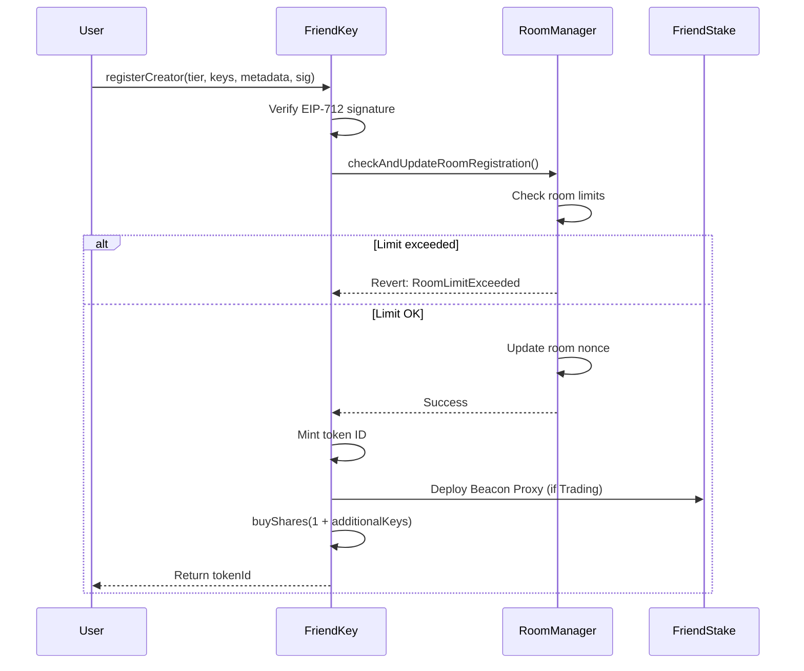
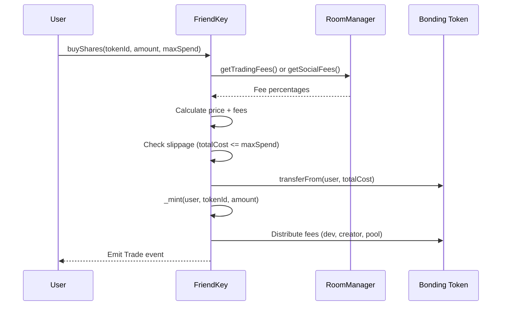
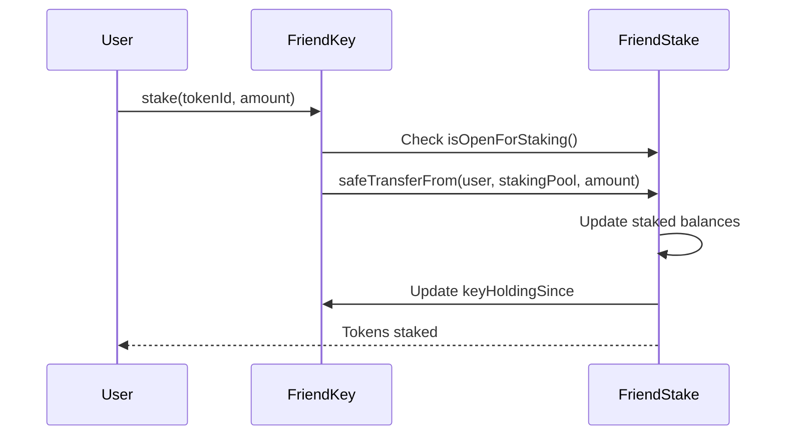

# FriendKey Developer Documentation

## Table of Contents
1. [Architecture Overview](#architecture-overview)
2. [Contract Interactions](#contract-interactions)
3. [Room Types & Tiers](#room-types--tiers)
4. [Bonding Curve Mechanics](#bonding-curve-mechanics)
5. [Fee Structure](#fee-structure)
6. [Upgradeability](#upgradeability)
7. [Testing Guide](#testing-guide)
8. [Deployment Guide](#deployment-guide)
9. [Integration Guide](#integration-guide)

---

## Contract Connections & Flow 

### note: FriendRoomMananger handles the fee part and admin/dev functionalities only, so not included below

```
                         ┌──────────────┐
                         │    USERS     │
                         └──────┬───────┘
                                │
                    ┌───────────┼───────────┐
                    │           │           │
              ┌─────▼────┐ ┌───▼────┐ ┌───▼────┐
              │ Register │ │  Buy   │ │  Sell  │
              │ Creator  │ │ Shares │ │ Shares │
              └─────┬────┘ └───┬────┘ └───┬────┘
                    │          │          │
                    └──────────┼──────────┘
                               │
                      ┌────────▼─────────┐
                      │   FriendKey      │◄────────┐
                      │  (UUPS Proxy)    │         │
                      │                  │         │
                      │ • ERC1155 Tokens │         │
                      │ • Bonding Curve  │         │
                      │ • Fee Distribution│        │
                      └──┬───┬───┬───┬───┘         │
                         │   │   │   │             │
        ┌────────────────┘   │   │   └─────────────┤
        │                    │   │                 │
        │ creates      fees  │   │ queries    calls│
        │                    │   │                 │
    ┌───▼────────┐    ┌─────▼───▼─────┐   ┌───────┴────────┐
    │ FriendStake│    │   FriendPool   │   │   FriendUSD    │
    │BeaconProxies│◄───┤  (UUPS Proxy)  │   │   (USDC/ERC20) │
    │            │    │                │   │                │
    │ Creator #1 │    │ • Pool Fees    │   │ • Trading Token│
    │ Creator #2 │    │ • Cross-chain  │   │ • 6 decimals   │
    │ Creator #3 │    │ • DLN Bridge   │   └────────────────┘
    │ Creator #N │    └────────┬───────┘
    └────┬───────┘             │
         │                     │ dispatch
         │ rewards             │
         │                     ▼
         │              ┌──────────────┐
         │              │  DLN Source  │
         │              │ (deBridge)   │
         │              │              │
         │              │ Cross-chain  │
         └──────────────┤   Bridge     │
                        └──────────────┘
```

## Architecture Overview

### System Components

```
┌─────────────────────────────────────────────────────────────┐
│                      FriendKey Ecosystem                     │
└─────────────────────────────────────────────────────────────┘
                               │
        ┌──────────────────────┼──────────────────────┐
        │                      │                      │
        ▼                      ▼                      ▼
┌──────────────┐      ┌──────────────┐      ┌──────────────┐
│  FriendKey   │◄────►│RoomManager   │      │ FriendPool   │
│   (Core)     │      │  (Limits)    │      │ (Cross-chain)│
└──────┬───────┘      └──────────────┘      └──────────────┘
       │
       ├─────► FriendStake (per creator, Beacon Proxy, for trading rooms) 
       ├─────► BondingCurveLib (Library)
       └─────► ERC1155 Tokens (shares)
```

### Contract Responsibilities

| Contract | Primary Role | Key Features |
|----------|-------------|--------------|
| **FriendKey** | Core token logic | Buy/sell shares, register creators, staking interface |
| **FriendRoomManager** | Room limits & config | Fee management, room creation limits, bonding curve params |
| **FriendStake** | Staking rewards | Per-creator staking, reward distribution, eligibility tracking |
| **FriendPool** | Cross-chain ops | Reserve management, DLN integration, fund dispatching |
| **BondingCurveLib** | Price calculation | Pure math functions for bonding curve pricing |

---

## Contract Interactions

### User Flow: Registering a Creator



### User Flow: Buying Shares



### User Flow: Staking



---

## Room Types & Tiers

### Room Types

```solidity
enum RoomType {
    Trading,  // Full functionality: trading, staking, cross-chain
    Social    // Limited: chats only, no staking/pool
}
```

| Feature | Trading Rooms | Social Rooms |
|---------|--------------|--------------|
| Token Trading | ✅ | ✅ |
| Staking Pool | ✅ | ❌ |
| Trading Pool Fee | ✅ | ❌ 0 |
| Cross-chain | ✅ | ❌ |

### Room Tiers

```solidity
enum RoomTier {
    Casual,     // Divisor: 4000 (trading) / 8000 (social) - Lowest prices
    Club,       // Divisor: 40 (trading) / 80 (social) - Medium prices
    Exclusive   // Divisor: 4 (trading) / 8 (social) - Highest prices
}
```

**Price Impact**: Lower divisor = Higher prices = More exclusive

### Room Limits (Default Configuration)

```javascript
// Trading Rooms (per creator per tier)
maxRoomsPerTier[Trading][Casual] = 0;     // Disabled by default
maxRoomsPerTier[Trading][Club] = 1;       // 1 Club room allowed
maxRoomsPerTier[Trading][Exclusive] = 1;  // 1 Exclusive room allowed

// Social Rooms (per creator per tier)
maxRoomsPerTier[Social][Casual] = 0;      // Disabled by default
maxRoomsPerTier[Social][Club] = 0;        // Disabled by default
maxRoomsPerTier[Social][Exclusive] = 0;   // Disabled by default
```

**Note**: Limits can be changed by contract owner via `FriendRoomManager.setMaxRoomsPerTier()`

---

## Bonding Curve Mechanics

### Formula

The bonding curve uses a polynomial pricing model:

```javascript
price = (summation * bondingTokenPriceUnit) / divisor

where:
summation = sum of squares from (supply+1) to (supply+amount)
          = (supply * (supply + 1) * (2 * supply + 1)) / 6
          + (supply * amount)
          + (amount * (amount + 1) * (2 * amount + 1)) / 6
```

### Price Calculation Examples

**Example 1: First key purchase (Club tier, Trading)**
```javascript
supply = 0, amount = 1, divisor = 40
summation = (0 * 1 * 1) / 6 + (0 * 1) + (1 * 2 * 3) / 6 = 1
price = (1 * 1,000,000) / 40 = 25,000 USDC (0.025 USDC with 6 decimals)
```

**Example 2: Buying 10 keys when supply is 100**
```javascript
supply = 100, amount = 10, divisor = 40
summation ≈ 10,525
price = (10,525 * 1,000,000) / 40 = 263,125,000 (263.125 USDC)
```

### Divisor Impact

```
Tier        | Trading Divisor | Social Divisor | Price Ratio
------------|----------------|----------------|-------------
Casual      | 4000          | 8000          | 1x (baseline)
Club        | 40            | 80            | 100x
Exclusive   | 4             | 8             | 1000x
```

**Social rooms have 2x higher divisors = 50% lower prices than trading rooms**

---

## Fee Structure

### Trading Rooms (Default Fees)

```javascript
devFeePercent = 200;              // 2% to dev address
creatorFeePercent = 200;          // 2% to creator
tradingPoolFeePercent = 600;      // 6% to trading pool
// Total: 10%

devPerformanceFeePercent = 500;   // 5% on staking rewards
creatorPerformanceFeePercent = 1500; // 15% on staking rewards
```

### Social Rooms (Default Fees)

```javascript
socialDevFeePercent = 200;        // 2% to dev address
socialCreatorFeePercent = 200;    // 2% to creator
// Total: 4%
// No trading pool fee (social rooms don't have pools)
```

### Fee Distribution Flow

```
Buy Transaction (Trading Room):
┌──────────────┐
│ User pays:   │
│ 100 USDC     │
└──────┬───────┘
       │
       ├─► 2 USDC  → Dev address
       ├─► 2 USDC  → Creator address
       ├─► 6 USDC  → Trading Pool (FriendPool)
       └─► 90 USDC → Bonding Curve Reserve
```

### Slippage Protection

```solidity
// Buy with maximum spend limit
buyShares(tokenId, 10, 100_000000); // Max 100 USDC
// Reverts if totalCost > 100 USDC

// Sell with minimum receive limit
sellShares(tokenId, 5, 50_000000); // Min 50 USDC
// Reverts if proceeds < 50 USDC
```


### Storage Layout

**Critical**: Storage layout must be preserved across upgrades!

```solidity
// FriendKey storage (simplified)
contract FriendKey {
    uint256 internal _nextTokenId;        // Slot 0
    uint256 public BPS_SCALE;             // Slot 1
    address public friendStakeBeacon;     // Slot 2
    IERC20Metadata public bondingToken;   // Slot 3
    // ... more state variables ...
    
    uint256[50] private __gap;            // Reserved for future use
}
```

**Storage Gap**: Reserves slots for adding new variables in future versions without breaking storage layout.

### Upgrade Process

1. **Deploy new implementation**:
   ```bash
   forge script script/FriendKeyUpgrade.s.sol --broadcast
   ```

2. **Validate upgrade safety**:
   ```bash
   npx @openzeppelin/upgrades-core validate
   ```

3. **Upgrade proxy**:
   ```solidity
   // Call upgradeToAndCall on the proxy
   proxy.upgradeToAndCall(newImplementation, initData);
   ```

### Upgrade Checklist

- [ ] Storage layout unchanged (no reordering, no type changes)
- [ ] New variables added only to the end
- [ ] Constructor is disabled (`_disableInitializers()`)
- [ ] Initializer used instead of constructor
- [ ] `_authorizeUpgrade` restricted to owner
- [ ] Tests pass for both old and new versions
- [ ] Upgrade safety validation passes

---

## Testing Guide

### Test Structure

```
test/
├── FriendKey.t.sol          # Core functionality tests
├── FriendStake.t.sol        # Staking tests
├── FriendPool.t.sol         # Cross-chain tests
├── FriendRoomManager.t.sol  # Room limit tests
└── MockBridge.t.sol         # Bridge integration tests
```

### Running Tests

```bash
# Run all tests
forge test

# Run specific test file
forge test --match-contract FriendKeyTest

# Run specific test function
forge test --match-test testBuyShares

# Run with verbosity
forge test -vvv

# Run with gas reporting
forge test --gas-report
```

### Test Coverage

```bash
# Generate coverage report
forge coverage

# Generate detailed HTML coverage report
forge coverage --report lcov
genhtml lcov.info -o coverage
open coverage/index.html
```

### Writing Tests

**Example: Testing Room Limits**

```solidity
function testCannotExceedRoomLimit() public {
    address creator = vm.addr(1);
    mockUsdc.mint(creator, 1_000_000 * 1e6);
    
    // Register first room (should succeed)
    vm.prank(creator);
    instance.registerCreator(RoomTier.Club, 0, "room1", sig1);
    
    // Try to register second room (should fail)
    vm.prank(creator);
    vm.expectRevert(Errors.RoomLimitExceeded.selector);
    instance.registerCreator(RoomTier.Club, 0, "room2", sig2);
}
```

---

## Deployment Guide

### Prerequisites

1. **Environment Setup**:
   ```bash
   cp .env.example .env
   # Fill in: PRIVATE_KEY, RPC_URL, etc.
   ```

2. **Compile Contracts**:
   ```bash
   forge build
   ```

3. **Validate Upgrade Safety** (if upgrading):
   ```bash
   npx @openzeppelin/upgrades-core validate
   ```

### Deployment Steps

#### 1. Deploy FriendRoomManager

```solidity
// Deploy proxy
bytes memory initData = abi.encodeCall(
    FriendRoomManager.initialize,
    (owner)
);
address rmProxy = Upgrades.deployUUPSProxy(
    "FriendRoomManager.sol",
    initData
);
```

#### 2. Deploy FriendStake Beacon

```solidity
// Deploy beacon with implementation
address beacon = Upgrades.deployBeacon(
    "FriendStake.sol",
    owner
);
```

#### 3. Deploy FriendKey

```solidity
// Deploy proxy
bytes memory initData = abi.encodeCall(
    FriendKey.initialize,
    (owner, bondingToken, stakeBeacon, roomManager)
);
address fkProxy = Upgrades.deployUUPSProxy(
    "FriendKey.sol",
    initData
);
```

#### 4. Link Contracts

```solidity
// Set FriendKey address in RoomManager
roomManager.setFriendKey(address(friendKey));

// Configure fees in RoomManager
roomManager.setTradingFees(200, 200, 600);  // 2%, 2%, 6%
roomManager.setSocialFees(200, 200);         // 2%, 2%
roomManager.setFeeDestinations(devAddr, poolAddr);
```

#### 5. Deploy FriendPool

```solidity
// Deploy proxy
bytes memory initData = abi.encodeCall(
    FriendPool.initialize,
    (owner, address(friendKey), dlnSource)
);
address poolProxy = Upgrades.deployUUPSProxy(
    "FriendPool.sol",
    initData
);
```

### Post-Deployment Configuration

```solidity
// Enable room types as needed
roomManager.enableRoomType(RoomType.Trading, RoomTier.Club);
roomManager.enableRoomType(RoomType.Social, RoomTier.Club);

// Set authority for signature verification
roomManager.setAuthority(authorityAddress);

// Set signee for registration signatures
friendKey.setSignee(signeeAddress);
```

### Deployment Verification

```bash
# Verify contracts on Etherscan
forge verify-contract <address> <contract> \
  --chain-id <id> \
  --etherscan-api-key <key>
```

---

## Integration Guide

### Frontend Integration

#### 1. Setup Contract Instances

```javascript
import { ethers } from 'ethers';
import FriendKeyABI from './abi/FriendKey.json';

const provider = new ethers.providers.Web3Provider(window.ethereum);
const signer = provider.getSigner();
const friendKey = new ethers.Contract(
  FRIEND_KEY_ADDRESS,
  FriendKeyABI,
  signer
);
```

#### 2. Register a Creator

```javascript
// Get EIP-712 signature from backend
const signature = await getRegisterSignature(
  userAddress,
  tier,
  additionalKeys,
  metadata
);

// Approve USDC spending
const usdc = new ethers.Contract(USDC_ADDRESS, ERC20_ABI, signer);
const price = await friendKey.getBuyPriceAfterFee(0, 1 + additionalKeys);
await usdc.approve(FRIEND_KEY_ADDRESS, price);

// Register
const tx = await friendKey.registerCreator(
  tier,           // 0=Casual, 1=Club, 2=Exclusive
  additionalKeys, // Number of additional keys
  metadata,       // IPFS hash or metadata string
  signature      // EIP-712 signature
);
await tx.wait();
```

#### 3. Buy Shares

```javascript
// Calculate price with slippage tolerance
const amount = 10;
const price = await friendKey.getBuyPriceAfterFee(tokenId, amount);
const maxSpend = price.mul(105).div(100); // 5% slippage

// Approve USDC
await usdc.approve(FRIEND_KEY_ADDRESS, maxSpend);

// Buy shares
const tx = await friendKey.buyShares(tokenId, amount, maxSpend);
await tx.wait();
```

#### 4. Sell Shares

```javascript
// Calculate expected proceeds with slippage
const amount = 5;
const proceeds = await friendKey.getSellPriceAfterFee(tokenId, amount);
const minReceive = proceeds.mul(95).div(100); // 5% slippage

// Sell shares
const tx = await friendKey.sellShares(tokenId, amount, minReceive);
await tx.wait();
```

#### 5. Stake Tokens

```javascript
// Check if staking is open
const stakingPool = await friendKey.stakingPoolByTokenId(tokenId);
const isOpen = await FriendStake.attach(stakingPool).isOpenForStaking();

if (isOpen) {
  // Stake tokens
  const tx = await friendKey.stake(tokenId, amount);
  await tx.wait();
}
```

### Backend: EIP-712 Signature Generation

```javascript
const { ethers } = require('ethers');

async function generateRegisterSignature(
  accountAddress,
  tier,
  additionalKeys,
  metadata
) {
  // Get nonce
  const nonce = await friendKey.registerCreatorNonces(accountAddress);
  
  // EIP-712 domain
  const domain = {
    name: 'FriendKey',
    version: '1',
    chainId: await signer.getChainId(),
    verifyingContract: FRIEND_KEY_ADDRESS
  };
  
  // EIP-712 types
  const types = {
    RegisterCreator: [
      { name: 'account', type: 'address' },
      { name: 'tier', type: 'uint8' },
      { name: 'additionalKeys', type: 'uint256' },
      { name: 'nonce', type: 'uint256' },
      { name: 'metadata', type: 'string' }
    ]
  };
  
  // Message
  const value = {
    account: accountAddress,
    tier: tier,
    additionalKeys: additionalKeys,
    nonce: nonce.toString(),
    metadata: metadata
  };
  
  // Sign
  const signature = await signer._signTypedData(domain, types, value);
  return signature;
}
```

### Subgraph Integration

#### Entity Schema

```graphql
type Creator @entity {
  id: ID!                           # tokenId
  address: Bytes!                   # creator address
  roomType: RoomType!               # Trading or Social
  roomTier: RoomTier!               # Casual, Club, or Exclusive
  totalSupply: BigInt!              # current supply
  bondingCurveReserve: BigInt!      # reserve amount
  stakingPool: Bytes                # staking pool address (null for Social)
  createdAt: BigInt!                # timestamp
  trades: [Trade!]! @derivedFrom(field: "creator")
}

type Trade @entity {
  id: ID!                           # txHash-logIndex
  tokenId: BigInt!                  # creator's token ID
  trader: Bytes!                    # trader address
  creator: Creator!                 # creator entity
  isBuy: Boolean!                   # true=buy, false=sell
  shareAmount: BigInt!              # shares traded
  tokenAmount: BigInt!              # USDC amount
  supply: BigInt!                   # supply after trade
  timestamp: BigInt!                # block timestamp
}
```

---

## Advanced Topics

### Gas Optimization

1. **Batch Operations**: Process multiple actions in one transaction
2. **Storage Packing**: Variables packed into uint16 for fee percentages
3. **Library Usage**: `BondingCurveLib` for pure calculations
4. **Minimal Events**: Only essential events emitted

### Security Considerations

See `SECURITY_ANALYSIS.md` for detailed security review and recommendations.

**Key Points**:
- [ ] Implement reentrancy guards
- [ ] Add pause mechanism
- [ ] Use multi-sig for owner operations
- [ ] Add price sanity checks
- [ ] Conduct professional audit

### Error Handling

All errors use custom errors for gas efficiency:

```solidity
// Common errors
error ZeroAddress();
error AmountMustBeGreaterThanZero();
error InsufficientBalance();
error CreatorNotRegistered();

// Fee errors
error TotalFeePercentTooHigh();

// Room management errors
error RoomLimitExceeded();
error RoomManagerNotSet();

// Slippage errors
error SlippageExceededMaxSpend();
error SlippageExceededMinReceive();
```

---

## Resources

- **OpenZeppelin Upgrades**: https://docs.openzeppelin.com/upgrades-plugins/
- **Foundry Book**: https://book.getfoundry.sh/
- **EIP-712**: https://eips.ethereum.org/EIPS/eip-712
- **UUPS Pattern**: https://eips.ethereum.org/EIPS/eip-1822

---

**Version**: 1.0.0

